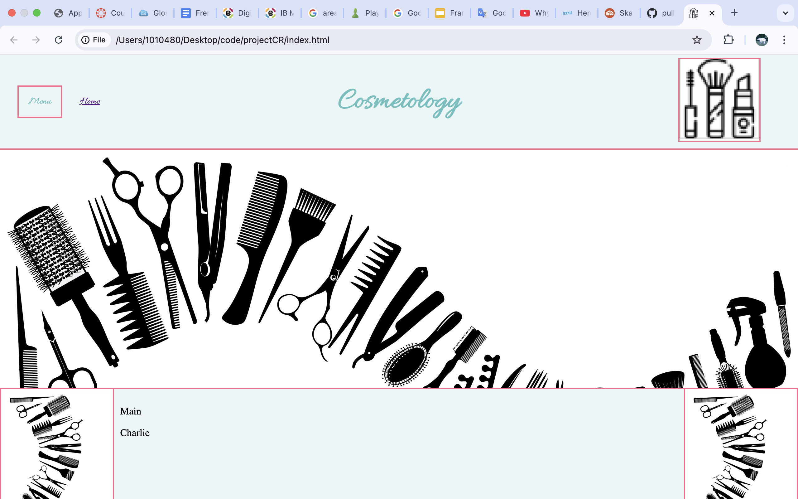
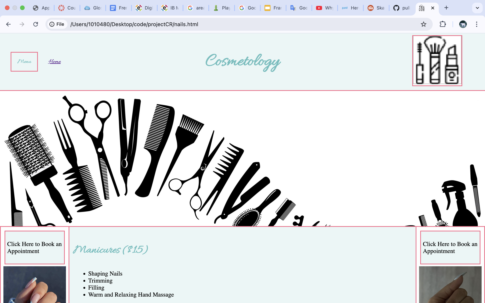
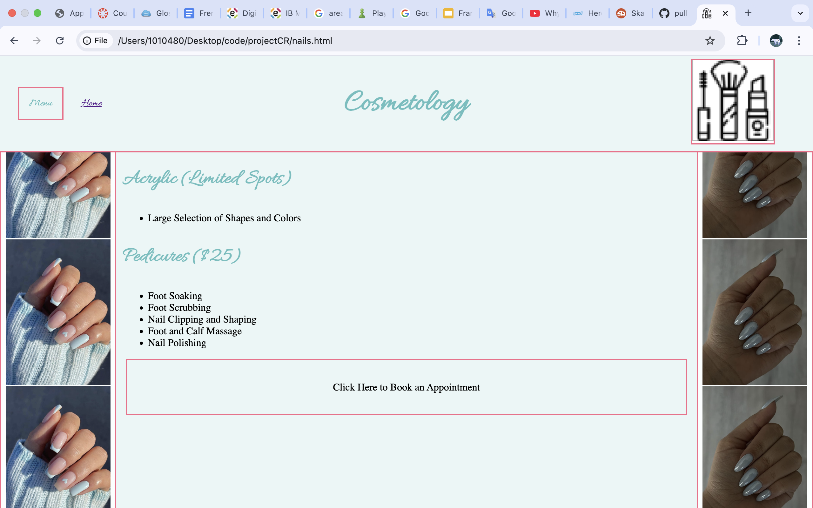
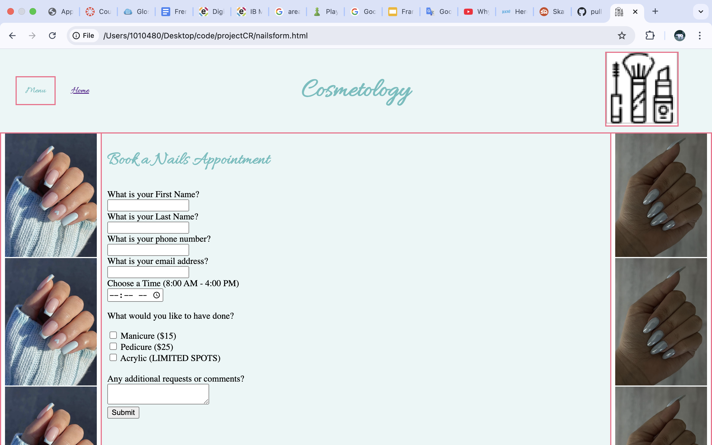
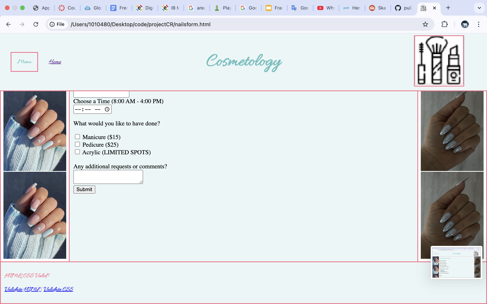

This project was very fun and I got to put a lot of my html and css skills to real use. I also got to work along with my friend raphael which made it even better. For the form that I made I used various input types including tel, email, and time. I also used chekboxes. The pages I worked on were the home page, nails page, and nails form page. I also did the css for the whole webiste and the header for the whole website.

[git hub](https://github.com/charlfresh/projectCR)
